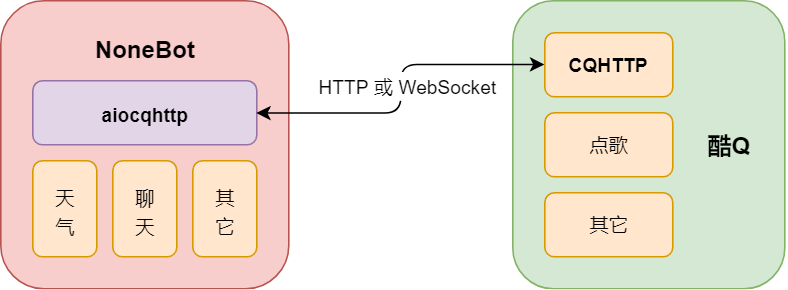

# NoneBot

## 简介

NoneBot 是一个基于 [酷Q](https://cqp.cc/) 的 Python 异步 QQ 机器人框架，它会对 QQ 机器人收到的消息进行解析和处理，并以插件化的形式，分发给消息所对应的命令处理器和自然语言处理器，来完成具体的功能。

除了起到解析消息的作用，NoneBot 还为插件提供了大量实用的预设操作和权限控制机制，尤其对于命令处理器，它更是提供了完善且易用的会话机制和内部调用机制，以分别适应命令的连续交互和插件内部功能复用等需求。

NoneBot 在其底层与 酷Q 交互的部分使用 [python-aiocqhttp](https://github.com/richardchien/python-aiocqhttp) 库，后者是 [CoolQ HTTP API 插件](https://cqhttp.cc/) 的一个 Python 异步 SDK，在 [Quart](https://pgjones.gitlab.io/quart/) 的基础上封装了与 CoolQ HTTP API 插件的网络交互。

得益于 Python 的 [asyncio](https://docs.python.org/3/library/asyncio.html) 机制，NoneBot 处理消息的吞吐量有了很大的保障，再配合 CoolQ HTTP API 插件可选的 WebSocket 通信方式（也是最建议的通信方式），NoneBot 的性能可以达到 HTTP 通信方式的两倍以上，相较于传统同步 I/O 的 HTTP 通信，更是有质的飞跃。

需要注意的是，NoneBot 仅支持 Python 3.7+ 及 CoolQ HTTP API 插件 v4.8+。

## 示意图

## 文档

文档目前「指南」和「API」部分已经完成，「进阶」部分尚未完成，你可以在 [这里](https://nonebot.cqp.moe/) 查看。

## 贡献

如果你在使用过程中发现任何问题，可以 [提交 issue](https://github.com/richardchien/nonebot/issues/new) 或自行 fork 修改后提交 pull request。

如果你要提交 pull request，请确保你的代码风格和项目已有的代码保持一致，遵循 [PEP 8](https://www.python.org/dev/peps/pep-0008/)，变量命名清晰，有适当的注释。
