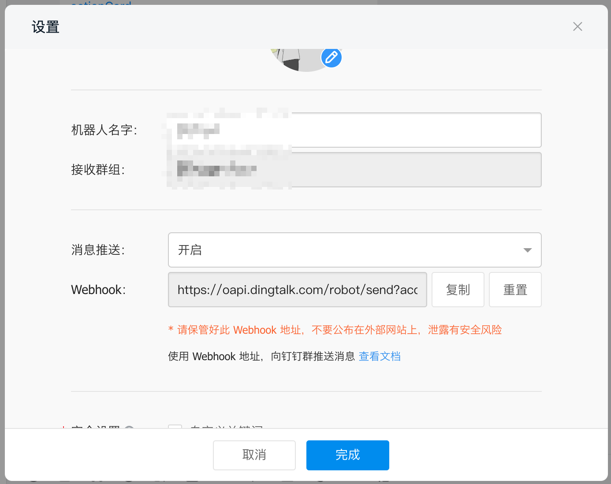
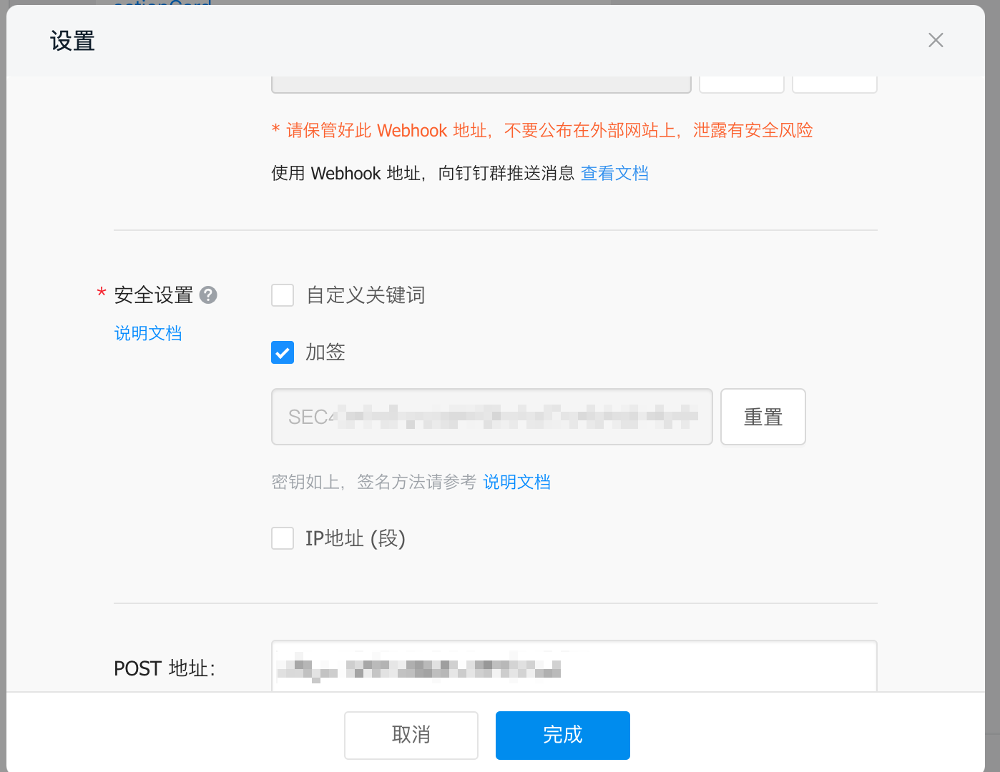
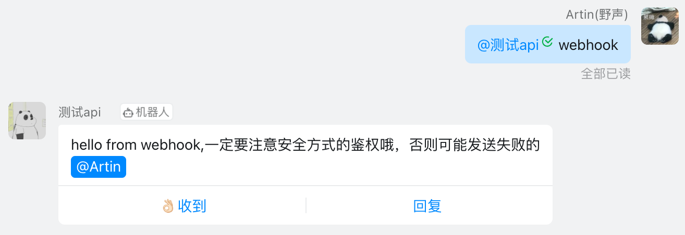

# 钉钉机器人使用指南

基于企业机器人的 outgoing（回调）机制，用户@机器人之后，钉钉会将消息内容 POST 到开发者的消息接收地址。开发者解析出消息内容、发送者身份，根据企业的业务逻辑，组装响应的消息内容返回，钉钉会将响应内容发送到群里。

::: warning 只有企业内部机器人支持接收消息
普通的机器人尚不支持应答机制，该机制指的是群里成员在聊天@机器人的时候，钉钉回调指定的服务地址，即 Outgoing 机器人。
:::

首先你需要有钉钉机器人的相关概念，请参阅相关文档：

- [群机器人概述](https://developers.dingtalk.com/document/app/overview-of-group-robots)
- [开发企业内部机器人](https://developers.dingtalk.com/document/app/develop-enterprise-internal-robots)

钉钉官方机器人教程（Java）：

- [开发一个钉钉机器人](https://developers.dingtalk.com/document/tutorial/create-a-robot)

## 安装 NoneBot 钉钉 适配器

```bash
pip install nonebot-adapter-ding
```

## 关于 DingAdapter 的说明

你需要显式的注册 ding 这个适配器：

```python{2,6}
import nonebot
from nonebot.adapters.ding import Bot as DingBot

nonebot.init()
driver = nonebot.get_driver()
driver.register_adapter("ding", DingBot)
nonebot.load_builtin_plugins()

if __name__ == "__main__":
    nonebot.run()
```

注册适配器的目的是将 `/ding` 这个路径挂载到程序上，并且和 DingBot 适配器关联起来。之后钉钉把收到的消息回调到 `http://xx.xxx.xxx.xxx:{port}/ding` 时，Nonebot 才知道要用什么适配器去处理该消息。

## 第一个命令

因为 Nonebot 可以根据你的命令处理函数的类型注解来选择使用什么 Adapter 进行处理，所以你如果需要使用钉钉相关的功能，你的 handler 中 `bot` 类型的注解需要是 DingBot 及其父类。

对于 Event 来说也是如此，Event 也可以根据标注来判断，比如一个 handler 的 event 标注位 `PrivateMessageEvent`，那这个 handler 只会处理私聊消息。

举个栗子：

```python
test = on_command("test", to_me())


@test.handle()
async def test_handler1(bot: DingBot, event: PrivateMessageEvent):
    await test.finish("PrivateMessageEvent")


@test.handle()
async def test_handler2(bot: DingBot, event: GroupMessageEvent):
    await test.finish("GroupMessageEvent")
```

这样 Nonebot 就会根据不同的类型注解使用不同的 handler 来处理消息。

可以查看 Nonebot 官方的这个例子：<https://github.com/nonebot/nonebot2/tree/dev/tests>，更详细的了解一个 Bot 的结构。

## 多种消息格式

发送 markdown 消息：

```python
@markdown.handle()
async def markdown_handler(bot: DingBot):
    message = MessageSegment.markdown(
        "Hello, This is NoneBot",
        "#### NoneBot  \n> Nonebot 是一款高性能的 Python 机器人框架\n> \n> [GitHub 仓库地址](https://github.com/nonebot/nonebot2) \n"
    )
    await markdown.finish(message)
```

可以按自己的需要发送原生的格式消息（需要使用 `MessageSegment` 包裹，可以很方便的实现 @ 等操作）：

```python
@raw.handle()
async def raw_handler(bot: DingBot, event: MessageEvent):
    message = MessageSegment.raw({
        "msgtype": "text",
        "text": {
            "content": f"@{event.senderId}，你好"
        },
    })
    message += MessageSegment.atDingtalkIds(event.senderId)
    await raw.send(message)
```

其他消息格式请查看 [钉钉适配器的 MessageSegment](https://github.com/nonebot/nonebot2/blob/dev/nonebot/adapters/ding/message.py#L8)，里面封装了很多有关消息的方法，比如 `code`、`image`、`feedCard` 等。

## 发送到特定群聊

钉钉也支持通过 Webhook 的方式直接将消息推送到某个群聊([参考链接](https://developers.dingtalk.com/document/app/custom-robot-access/title-zob-eyu-qse))，你可以在机器人的设置中看到当前群的 Webhook 地址。



获取到 Webhook 地址后，用户可以向这个地址发起 HTTP POST 请求，即可实现给该钉钉群发送消息。

对于这种通过 Webhook 推送的消息，钉钉需要开发者进行安全方面的设置（目前有 3 种安全设置方式，请根据需要选择一种），如下：

1. **自定义关键词：** 最多可以设置 10 个关键词，消息中至少包含其中 1 个关键词才可以发送成功。
   例如添加了一个自定义关键词：监控报警，则这个机器人所发送的消息，必须包含监控报警这个词，才能发送成功。
2. **加签：** 发送请求时带上验签的值，可以在机器人设置里看到密钥。
   
3. **IP 地址（段）：** 设定后，只有来自 IP 地址范围内的请求才会被正常处理。支持两种设置方式：IP 地址和 IP 地址段，暂不支持 IPv6 地址白名单。

如果你选择 1/3 两种安全设置，你需要自己确认当前网络和发送的消息能被钉钉接受，然后使用 `bot.send` 的时候将 webhook 地址传入 webhook 参数即可。

如我设置了 `打卡` 为关键词：

```python
message = MessageSegment.text("打卡成功：XXXXXX")
await hello.send(
    message,
    webhook=
    "https://oapi.dingtalk.com/robot/send?access_token=XXXXXXXXXXXXXX",
)
```

对于第二种加签方式，你可以在 `bot.send` 的时候把 `secret` 参数传进去，Nonebot 内部会自动帮你计算发送该消息的签名并发送，如：

这里的 `secret` 参数就是加签选项给出的那个密钥。

```python
message = MessageSegment.raw({
    "msgtype": "text",
    "text": {
        "content": 'hello from webhook,一定要注意安全方式的鉴权哦，否则可能发送失败的'
    },
})
message += MessageSegment.atDingtalkIds(event.senderId)
await hello.send(
    message,
    webhook="https://oapi.dingtalk.com/robot/send?access_token=XXXXXXXXXXXXXX",
    secret="SECXXXXXXXXXXXXXXXXXXXXXXXXX",
)
```

然后就可以发送成功了。



## 创建机器人并连接

在钉钉官方文档 [「开发企业内部机器人 -> 步骤一：创建机器人应用」](https://developers.dingtalk.com/document/app/develop-enterprise-internal-robots/title-ufs-4gh-poh) 中有详细介绍，这里就省去创建的步骤，介绍一下如何连接上程序。

### 本地开发机器人

在本地开发机器人的时候可能没有公网 IP，钉钉官方给我们提供一个 [内网穿透工具](https://developers.dingtalk.com/document/resourcedownload/http-intranet-penetration?pnamespace=app)，方便开发测试。

::: tip
究其根源这是一个魔改版的 ngrok，钉钉提供了一个服务器。

本工具不保证稳定性，仅适用于开发测试阶段，禁止当作公网域名使用。如线上应用使用本工具造成稳定性问题，后果由自己承担。如使用本工具传播违法不良信息，钉钉将追究法律责任。
:::

官方文档里已经讲了如何使用。我们再以 Windows（终端使用 Powershell） 为例，来演示一下。

1. 将仓库 clone 到本地，打开 `windows_64` 文件夹。
2. 执行 `.\ding.exe -config="./ding.cfg" -subdomain=rcnb 8080` 就可以将 8080 端口暴露到公网中。  
   你访问 <http://rcnb.vaiwan.com/xxxxx> 都会映射到 <http://127.0.0.1:8080/xxxxx>。

假设我们的机器人监听的端口是 `2333`，并且已经注册了钉钉适配器。那我们就执行 `.\ding.exe -config="./ding.cfg" -subdomain=rcnb 2333`，然后在机器人的后台设置 POST 的地址：`http://rcnb.vaiwan.com/ding`。  
这样钉钉接收到消息之后就会 POST 消息到 `http://rcnb.vaiwan.com/ding` 上，然后这个服务会把消息再转发到我们本地的开发服务器上。

### 生产模式

生产模式你的机器需要有一个公网 IP，然后到机器人的后台设置 POST 的地址就好了。

## 示例

关于钉钉机器人能做啥，你可以查看 `https://github.com/nonebot/nonebot2/blob/dev/tests/test_plugins/test_ding.py`，里面有一些例子。
