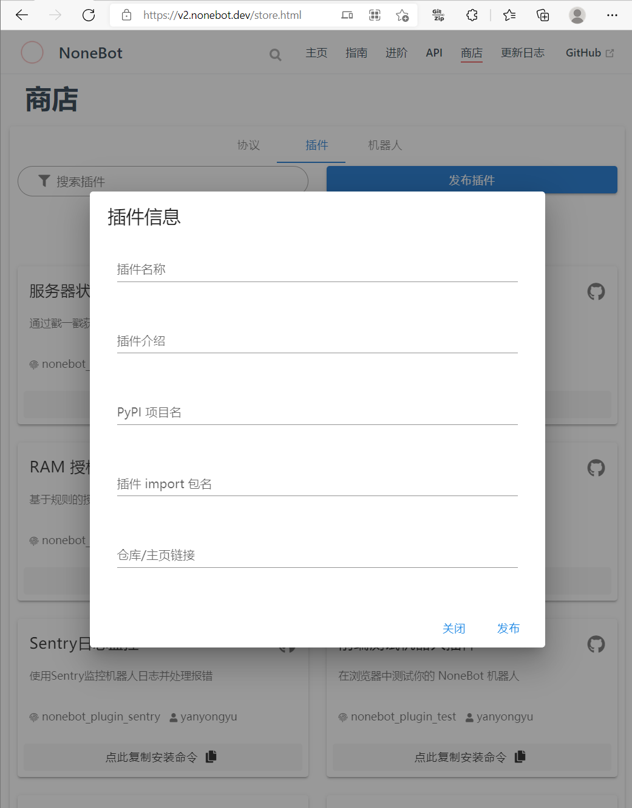
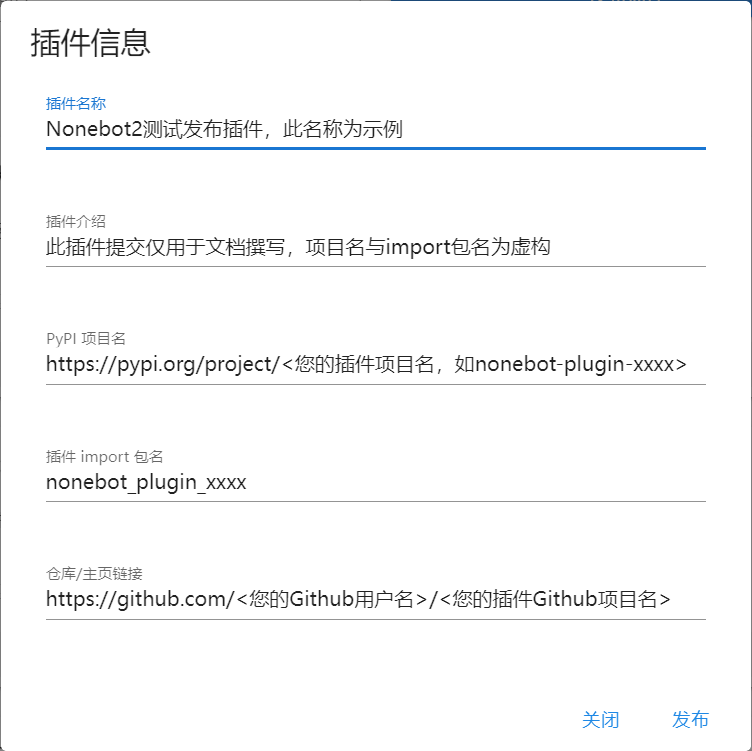

# 发布插件

### 前注
本章节仅包含插件发布流程指导，插件开发请查阅 **[创建插件](../guide/creating-a-plugin.md)** 章节与 **[Plugin API 文档](../api/plugin.md)** 。

## 插件发布流程
### 发布到pypi
您可以选择任意自己喜欢的方式将您的插件发布到 **[PyPI](https://pypi.org/)** ，如使用 **[setuptools](https://pypi.org/project/setuptools/)** 或 **[poetry](https://pypi.org/project/poetry/)** 进行PyPI发布。

发布时，请您为自己的插件取一个清晰易懂的名字，约定俗成的 Nonebot2 插件通常使用 *nonebot-plugin-xxxx* 的插件名与 *nonebot_plugin_xxxx* 的导入名，但这不是强制的。

发布后，请确保您的插件已能公开的从 PyPI 访问到，请检查您的插件在PyPI的地址：`https://pypi.org/project/<your_nonebot2_plugin_name>`

### 托管您的插件源代码
将插件源代码及相关构建文件（如`pyproject.toml`或`setup.py`等与PyPI包构建相关的文件）托管在公开代码仓。

请确保您的代码仓地址能够被正确的访问，检查您的插件在代码仓的地址，如 `https://github.com/<您的Github用户名>/<您的插件Github项目名>` 。

### 申请发布到Nonebot2插件商店
完成在 PyPI 的插件发布流程与源代码托管流程后，请您前往 **[Nonebot2商店](https://v2.nonebot.dev/store.html)** 页面，切换到插件页签，点击 **发布插件** 按钮。

如图所示，在弹出的插件信息提交表单内，填入您所要发布的相应插件信息。

完成填写后，请点击 **发布** 按钮，这将自动在 **[Nonebot2](https://github.com/nonebot/nonebot2)** 代码仓内创建发布您的插件的对应Issue。

### 等待插件发布处理
您的插件发布Issue创建后，将会经过*Nonebot2 Publish Bot*的检查，以确保插件信息正确无误。

通过检查后，您的插件发布信息将通过一次Pull Request更新到Nonebot2商店。

完成此更新后，您的插件发布Issue将被自动关闭。

## 完成！
恭喜您，经过上述的发布流程，您的插件已经成功发布到Nonebot2商店了。

此时，您应当可以在 **[Nonebot2商店](https://v2.nonebot.dev/store.html)** 的插件页签查找到您的插件了，插件发布流程全部完成。

Congratulations！
