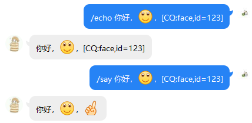

# 发生了什么？

上一章中我们已经运行了一个最小的 NoneBot 实例，在看着 QQ 机器人回复了自己的消息的同时，你可能想问，这是如何实现的？具体来说，NoneBot、CQHTTP 插件、酷Q，这三者是如何协同工作的？本章将对这个问题做一个初步解答。

:::tip 提示
如果你已经有较丰富的 QQ 机器人开发经验，尤其是使用 CQHTTP 插件的经验，可以直接跳到 [NoneBot 出场](#nonebot-出场)。
:::

## 一切从 酷Q 开始

我们在 [概览](./README.md) 中提到过，酷Q 扮演着「无头 QQ 客户端」的角色，一切的消息、通知、请求的发送和接收，最根本上都是由它来完成的，我们的最小 NoneBot 实例也不例外。

首先，我们向机器人发送的 `/echo 你好，世界` 进入腾讯的服务器，后者随后会把消息推送给 酷Q，就像推送给一个真正的 QQ 客户端一样。到这里，酷Q 就已经收到了我们发送的消息了。

## 进入 CQHTTP 插件

酷Q 在收到消息之后，按优先级依次将消息转交给已启用的各插件处理，在我们的例子中，只有一个插件，就是 CQHTTP 插件。

CQHTTP 插件收到消息后，会将其包装为一个统一的事件格式，并对消息内容进行一个初步的处理，例如编码转换、数组化、CQ 码增强等，这里的细节目前为止不需要完全明白，在需要的时候，可以去参考 CQHTTP 插件的 [文档](https://cqhttp.cc/docs/)。

接着，插件把包装好的事件转换成 JSON 格式，并通过「反向 WebSocket」发送给 NoneBot。这里的「反向 WebSocket」，连接的就是我们在 CQHTTP 插件的配置中指定的 `ws_reverse_url`，即 NoneBot 监听的 WebSocket 入口。

:::tip 提示
「反向 WebSocket」是 CQHTTP 插件的一种通信方式，表示插件作为客户端，主动去连接配置文件中指定的 `ws_reverse_url`。除此之外还有 HTTP、（正向）WebSocket 等方式。除了反向 WebSocket，NoneBot 也支持通过 HTTP 与 CQHTTP 通信。
:::

## NoneBot 出场

CQHTTP 插件通过反向 WebSocket 将消息事件发送到 NoneBot 后，NoneBot 就开始了它的处理流程。

### 初步处理

首先 NoneBot 利用底层的 aiocqhttp 区分事件类型，并通知到相应的函数，本例中，相应的函数就是负责处理消息的函数。

负责处理消息的函数会尝试把消息作为一个命令来解析，根据默认配置，它发现消息内容 `/echo 你好，世界` 符合命令的一个特征——以 `/` 开头，剥离掉这个起始字符之后，消息变为 `echo 你好，世界`，紧接着，它读取第一个空白字符之前的内容，即 `echo`，将其理解为命令的名字。

:::tip 提示
实际上，它还会使用配置中的分隔符对 `echo` 做一个分割，不过这里分割完也只有一个部分，所以实际命令名字为 `('echo',)`，形式是一个 Python 元组；而如果我们发送的命令是 `note.add`，分割之后就是 `('note', 'add')`。
:::

### 理解最小实例的代码

到这里，我们先暂停一下对消息事件的行踪的描述，回头来说一下最小实例的代码：

```python {4-6}
import nonebot

if __name__ == '__main__':
    nonebot.init()
    nonebot.load_builtin_plugins()
    nonebot.run(host='127.0.0.1', port=8080)
```

第 4 行的 `nonebot.init()` 首先初始化 `nonebot` 包，这是无论如何都需要写的一行代码，并且必须在使用 NoneBot 的任何功能之前调用。

随后，`nonebot.load_builtin_plugins()` 加载了 NoneBot 的内置插件，这一步不是必须的，尤其在你编写了自己的插件之后，可能不再需要内置插件。

NoneBot 的内置插件只包含了两个命令，`echo` 和 `say`，两者的功能都是重复发送者的话，区别在于，`echo` 命令任何人都可以调用（不限制权限），但只能原样重复消息，不能手动指定要发送的 CQ 码，`say` 命令只有超级用户（通常是你自己，需要在配置中指定，下一章会介绍）可以调用，可以在消息中指定要发送的 CQ 码，如下图：

<p style="text-align: center">
  
</p>

最后，`nonebot.run(host='127.0.0.1', port=8080)` 让 NoneBot 跑在了地址 `127.0.0.1:8080` 地址上，向 CQHTTP 插件提供 `/`、`/ws/` 等入口，在我们的反向 WebSocket 配置中，插件连接了 `/ws/`。

### 命令处理器

现在，我们知道了最小 NoneBot 实例中已经加载了 `echo` 和 `say` 两个命令，在 [初步处理](#初步处理) 中也知道了消息内容符合命令的格式，并且从中拿到了命令名（`echo`），这时候消息处理函数发现，这条消息中解析出来的命令确实是存在的，于是它将剩余部分（`你好，世界`）当做命令的参数，并通过命令名获取到对应的命令处理器，然后把参数、消息事件中附带的其它信息一起打包成一个 Session 对象（具体来说，是一个 `CommandSession` 类的对象），传给命令处理器来调用它。

`echo` 命令处理器的代码其实非常简单，如下：

```python
@on_command('echo')
async def echo(session: CommandSession):
    await session.send(session.state.get('message') or session.current_arg)
```

你现在不用关心它是如何从 Session 中拿到参数的，只需看到，命令处理器中实际内容只有一行 `session.send()` 函数调用，这个调用会直接把参数中的消息内容原样发送。

## 再次进入 CQHTTP 插件

命令处理器在调用 `session.send()` 之后，NoneBot 把消息内容发送给了 CQHTTP 插件那边已连接的反向 WebSocket 客户端，同时告诉它要把消息发送到和收到消息相同的地方（即接收到消息所在的群组、讨论组或私聊）。CQHTTP 插件明白了 NoneBot 的要求之后，会对消息做一些必要的处理，然后按照指示调用 酷Q 提供的相应接口。

## 一切又在 酷Q 结束

酷Q 收到 CQHTTP 插件的接口调用之后，将消息内容发送给腾讯的服务器，就像一个真正的 QQ 客户端一样，于是你就收到了 QQ 机器人发来的消息了。

至此，我们已经理清楚了第一次对话中每一步到底都发生了些什么，以及 NoneBot 如何解析消息并调用到相应的命令处理器来进行回复。下面的几章中我们将一步一步地对最小 NoneBot 实例进行扩充，以实现一些非常棒的功能！
