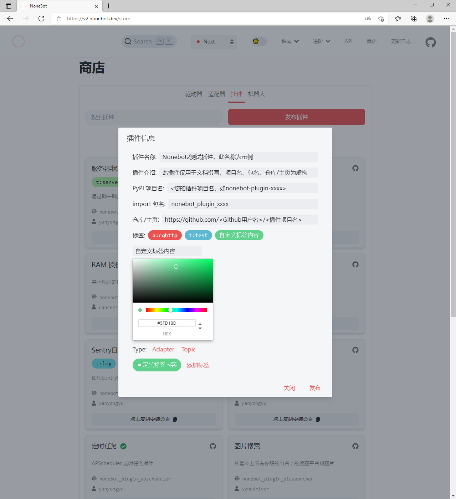

---
options:
  menu:
    weight: 70
    category: advanced
---

# 发布插件

## 前注

本章节仅包含插件发布流程指导，插件开发请查阅 **[创建插件](../tutorial/plugin/config-plugin.md)** 章节与 **[Plugin API 文档](../api/plugin.md)** 。

## 插件发布流程

### 发布到 PyPI

您可以选择任意自己喜欢的方式将您的插件发布到 **[PyPI](https://pypi.org/)** ，如使用 **[setuptools](https://pypi.org/project/setuptools/)** 或 **[poetry](https://pypi.org/project/poetry/)** 进行 PyPI 发布。

发布时，请您为自己的插件取一个清晰易懂的名字。通常而言，一款 NoneBot2 插件名称使用 `nonebot-plugin-` 作为前缀(如`nonebot-plugin-foo`)，以 `nonebot_plugin_` 作为导入名的前缀(如`nonebot_plugin_foo`)，这并非是强制规范, 而是为了防止与其他 PyPI 包产生冲突, 所以我们推荐您在没有特殊需求的情况下这样做。

发布后，请确保您的插件已能公开的从 PyPI 访问到，请检查您的插件在 PyPI 的地址：`https://pypi.org/project/<您的Nonebot2插件项目名>`

### 托管您的插件源代码

将插件源代码及相关构建文件（如`pyproject.toml`或`setup.py`等与 PyPI 包构建相关的文件）托管在公开代码仓。

请确保您的代码仓地址能够被正确的访问，检查您的插件在代码仓的地址，如 `https://github.com/<您的Github用户名>/<您的插件Github项目名>` 。

### 申请发布到 Nonebot2 插件商店

完成在 PyPI 的插件发布流程与源代码托管流程后，请您前往 **[NoneBot2 商店](https://v2.nonebot.dev/store.html)** 页面，切换到 **插件** 页签，点击 **发布插件** 按钮。


如图所示，在弹出的插件信息提交表单内，填入您所要发布的相应插件信息：

```text
插件名称： 您的Nonebot2插件名称
插件介绍： 为您的插件提供的简短介绍信息
PyPI项目名： 您的插件所在的PyPI Project名，如 nonebot-plugin-xxxx
import包名： 您的插件通过Python导入时使用的包名，如 nonebot_plugin_xxxx
仓库/主页： 您的插件托管地址，如 https://github.com/<您的Github用户名>/nonebot-plugin-xxxx
标签： 一个或多个可选颜色的TAG，每填写一个点击添加标签，若要删除，点击标签即可；标签长度不超过10字符，标签个数不超过3个
特定标签内容Adapter：点击Type的Adapter，将创建一个 a: 开头的标签，填入内容以指定您插件使用的adapter
特定标签内容Topic：点击Type的Topic，将创建一个 t: 开头的标签，填入内容以指定您插件的主题
```



完成填写后，请点击 **发布** 按钮，这将自动在 **[NoneBot2](https://github.com/nonebot/nonebot2)** 代码仓内创建发布您的插件的对应 Issue。

### 等待插件发布处理

您的插件发布 Issue 创建后，将会经过*Nonebot2 Publish Bot*的检查，以确保插件信息正确无误。

若您的插件发布 Issue 未通过检查，您可以 **直接修改** Issue内容以更新发布请求。*Nonebot2 Publish Bot*在您修改Issue内容后将会自动重新执行检查。您无需关闭、重新提交发布申请。

之后，NoneBot2 的维护者们将会对插件进行进一步的检查，以确保用户能够正常安装并使用该插件。

完成这些步骤后，您的插件将会被合并到 **[NoneBot2 商店](https://v2.nonebot.dev/store.html)** ，而您也将成为 **[NoneBot2 贡献者](https://github.com/nonebot/nonebot2/graphs/contributors)** 的一员。

## 完成

恭喜您，经过上述的发布流程，您的插件已经成功发布到 Nonebot2 商店了。

此时，您可以在 **[NoneBot2 商店](https://v2.nonebot.dev/store.html)** 的插件页签查找到您的插件。同时，欢迎您成为 **[NoneBot2 贡献者](https://github.com/nonebot/nonebot2/graphs/contributors)** ！

**Congratulations!**
